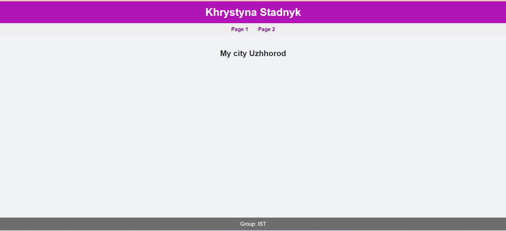
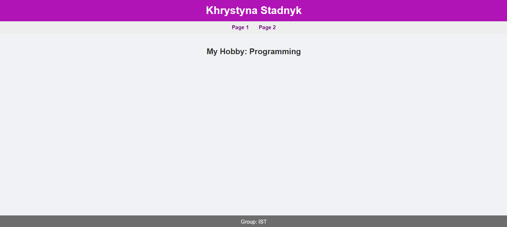

# React Project

### Основна інформація
- Ім'я: Khrystyna Stadnyk
- Місто: Uzhhorod
- Група: IST
- Хоббі: Reading

### Вміст проєкту
- **Header**: містить ім'я та прізвище.
- **Footer**: містить назву групи.
- **Page1**: показує місто.
- **Page2**: показує хоббі.
- Навігація між сторінками здійснюється за допомогою `react-router-dom`.

### Скріншоти
- **Page1 (місто)**  
  

- **Page2 (хоббі)**  
  

### Запуск проєкту
У каталозі проєкту виконайте:

```bash
npm start
